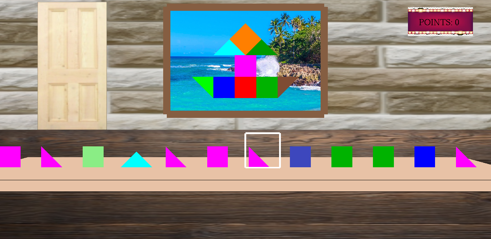

###RG94-shape-fitting

# :boat: Shape fitting



## :memo: Opis igre :

* Dobrodošli u sobu prepunu boja i oblika. Ona će vam pomoci da, na zanimljiv način, testirate poznavanje oblika i boja i oprobate vaše vizuelne i mototričke sposobnosti.

* Prilikom svakog pokretanja igrice, na slučajan način se iscrtavaju oblici na traci  i boje se različitim bojama. Selektor nam omogućava da odaberemo sa pokretene trake onaj oblik koji želimo i tada se on zaustavlja.  Na slici je iscrtan brodić od oblika, a svakom obliku potrebno je pronaći parnjak na slici, jednak kako po obliku, tako i po boji selektovanom objektu na traci.

* Cilj ove igre je uklopiti što više objekata sa trake na odgovarajuće mesto na slici. Poeni se povećavaju ukoliko su oblici isti po boji i obliku, u suprotnom se smanjuju.

- Za pobedu potrebno je postići bar 150 poena(uklopiti 15 oblika).
- Pet pogresno uklopljenih oblika- kraj igre.

## :video_game: Komande:

|Komanda                      |	Akcija |
|---                          | ---	|
| <kbd>G</kbd>/<kbd>g</kbd>   | Pokretanje igrice-start.Pokretanje igrice-nakon poraza.|
| <kbd>R</kbd>/<kbd>r</kbd>   | Restartovanje igrice.|
| <kbd>S</kbd>/<kbd>s</kbd>   |Pauziranje igrice. |
| <kbd>space</kbd>            | Selektovanje oblika na traci.|
| <em>levi klik na mis</em>   | Odabir oblika sa slike na zidu.|
| <kbd>ESC</kbd>              | Izlazak iz igrice.|


## :hammer: :wrench: Instalacija i pokretanje:

```shell
git clone https://github.com/MATF-RG19/RG94-shape-fitting
```

* Pozicionirajte se u direktorijum `RG94-shape-fitting/src/` <br>
* Pokrenite Makefile `make` <br>
* Pokrenite igricu komandom `./shape-fitting`


